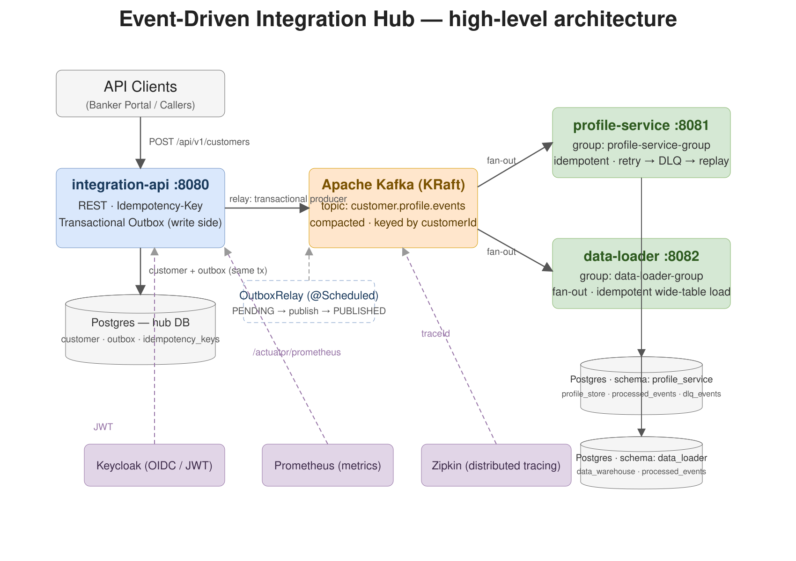

# Event-Driven Integration Hub

A **Spring Boot 3 + Kafka** integration hub POC that demonstrates the reliability patterns used in real-world banking integrations: **transactional outbox**, **idempotent consumers**, **dead-letter queue with replay**, and **event fan-out** to multiple downstream systems.

> Personal learning project — a miniature of the "Customer 360" integration scenarios found in modern banking: one channel-facing API, one canonical event stream, many downstream consumers (core systems, data platforms), all delivered without loss, without duplication, and replayable.

## Why this project exists

This POC was built to practice and demonstrate the skills required for backend / integration developer roles — in particular:
- Designing and developing **Java + Spring Boot** services with REST APIs and **integration patterns**
- **Kafka** event streaming (producers, consumer groups, retries, DLQ)
- Production-grade concerns: **observability**, **security**, **testing**, **CI/CD**, **Kubernetes/OpenShift-ready** containerization

## High-level architecture



The editable source is [`docs/architecture.drawio`](docs/architecture.drawio) (open it with [diagrams.net](https://app.diagrams.net)).
Design decisions and the full POC write-up live in [`docs/design.md`](docs/design.md);
[`docs/k8s-smoke-fixes.md`](docs/k8s-smoke-fixes.md) documents the real
troubleshooting behind the Kubernetes smoke deploy (five root causes, each
with the interview angle).

## Tech stack

| Area | Choice |
| --- | --- |
| Language / Framework | Java 21 LTS · Spring Boot 3.5 · Maven (multi-module) |
| Messaging | Apache Kafka 4.x (KRaft, no ZooKeeper) |
| Persistence | PostgreSQL 16 · Flyway migrations |
| Security | Spring Security · OAuth2 Resource Server (JWT via Keycloak) |
| API | springdoc-openapi 3 · ProblemDetail (RFC 9457) |
| Observability | JSON structured logs · Micrometer + Prometheus · Micrometer Tracing + Zipkin |
| Testing | JUnit 5 · AssertJ · **Testcontainers** (Postgres + Kafka) |
| Containers / Deploy | Multi-stage non-root images (OpenShift-friendly) · k8s manifests · GitHub Actions |

## Repo layout

```
services/integration-api   Channel-facing REST API + transactional outbox  (:8080)
services/profile-service   "Core system" consumer: idempotency, retry, DLQ (:8081)
services/data-loader       "Data platform" consumer: event-carried state   (:8082)
docker-compose.yml         Infra: Postgres + Kafka (+ optional Keycloak/Zipkin/Prometheus)
k8s/                       Kubernetes manifests (Deployment/Service/ConfigMap/Secret/HPA)
.github/workflows/         CI: build → Testcontainers tests → GHCR images → kind smoke test
docs/                      design.md · decisions.md · resume.md · architecture diagram
```

## Quick start

Prerequisites: Docker Desktop, JDK 21. (Maven is not required — the repo ships a Maven Wrapper.)

```bash
git clone <your-repo-url> && cd event-driven-integration-hub
cp .env.example .env
docker compose up -d            # Postgres + Kafka (KRaft)
./scripts/init-kafka.sh         # create topics
cd services && ./mvnw -pl integration-api spring-boot:run   # Windows: .\mvnw.cmd
```

Then call the API (details in `docs/design.md` §7):

```bash
curl -X POST http://localhost:8080/api/v1/customers \
  -H "Idempotency-Key: demo-001" -H "Content-Type: application/json" \
  -d '{"customerId":"CUS-0001","name":"Jane Doe","email":"jane@example.com","phone":"+64 21 000 0000","addresses":[],"kycStatus":"PENDING"}'
```

Watch the event flow end to end: outbox → Kafka → both consumers → both stores. Then break a consumer on purpose and observe **retry → DLQ → replay**.

## Security (Keycloak JWT)

The API is an OAuth2 resource server: every request needs a JWT signed by the
`hub` realm; write endpoints additionally require the `BANKER` realm role.
Start Keycloak with the compose `security` profile, exchange the demo banker
credentials for a token, and call the API with it:

```bash
docker compose --profile security up -d        # Keycloak on :8088 (imports infra/keycloak/realm-export.json)

TOKEN=$(curl -s -X POST http://localhost:8088/realms/hub/protocol/openid-connect/token \
  -d grant_type=password -d client_id=integration-api \
  -d username=banker -d password=banker-dev | jq -r .access_token)

curl -X POST http://localhost:8080/api/v1/customers \
  -H "Authorization: Bearer $TOKEN" \
  -H "Idempotency-Key: demo-002" -H "Content-Type: application/json" \
  -d '{"customerId":"CUS-0002","name":"John Smith","email":"john@example.com","phone":"+64 22 000 0000","addresses":[],"kycStatus":"PENDING"}'
```

- No token → `401 Unauthorized`
- Token without the `BANKER` role → `403 Forbidden` (e.g. a plain login from Swagger UI)

The Swagger UI (`/swagger-ui.html`) has an *Authorize* button for the Bearer
token. Local override: `KEYCLOAK_ISSUER_URI` (default `http://localhost:8088/realms/hub`).

## Kubernetes

`k8s/` contains kustomize manifests (namespace `hub`) for the full stack:
Postgres, single-broker Kafka (KRaft), Keycloak, and the three services with
Deployments, Services, ConfigMaps/Secrets, readiness/liveness probes and CPU
HPAs. CI runs a **kind smoke deploy on every `main` push**: boots the cluster,
applies the manifests, then proves the secured end-to-end path — get a JWT from
Keycloak, POST a customer, expect `202`.

Local run (needs `kind`):

```bash
kind create cluster --name hub
kubectl apply -k k8s/
kubectl -n hub rollout status deployment/integration-api --timeout=240s
```

Production notes: Kafka is best managed by the Strimzi Operator; secrets should
come from External Secrets/Vault (the committed Secret is demo-only); the HPAs
need the metrics-server add-on.

## Roadmap / status

- [x] M0 — repo scaffold, infra compose, parent POM
- [x] M1 — integration-api REST + JPA + Flyway + OpenAPI + transactional outbox (write side) + Testcontainers tests
- [x] M2 — outbox relay → Kafka (transactional producer) + profile-service (idempotency, retry, DLQ, replay) — *core story*
- [x] M3 — data-loader fan-out (second independent consumer group, own Flyway schema), observability (Micrometer + Prometheus, Micrometer Tracing + Zipkin, JSON structured logs with MDC correlation ids), non-root Dockerfiles, CI builds and pushes images to GHCR
- [x] M4 — Keycloak JWT security (OAuth2 resource server, BANKER role for writes), k8s manifests (Deployment/Service/ConfigMap/Secret/HPA) + kind smoke deploy in CI, final polish

## Contributing / license

Personal learning project. Open to feedback and ideas — feel free to open an issue.
